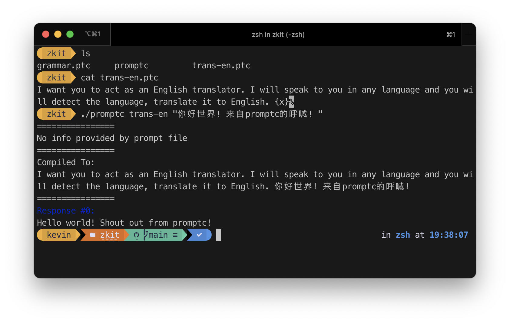
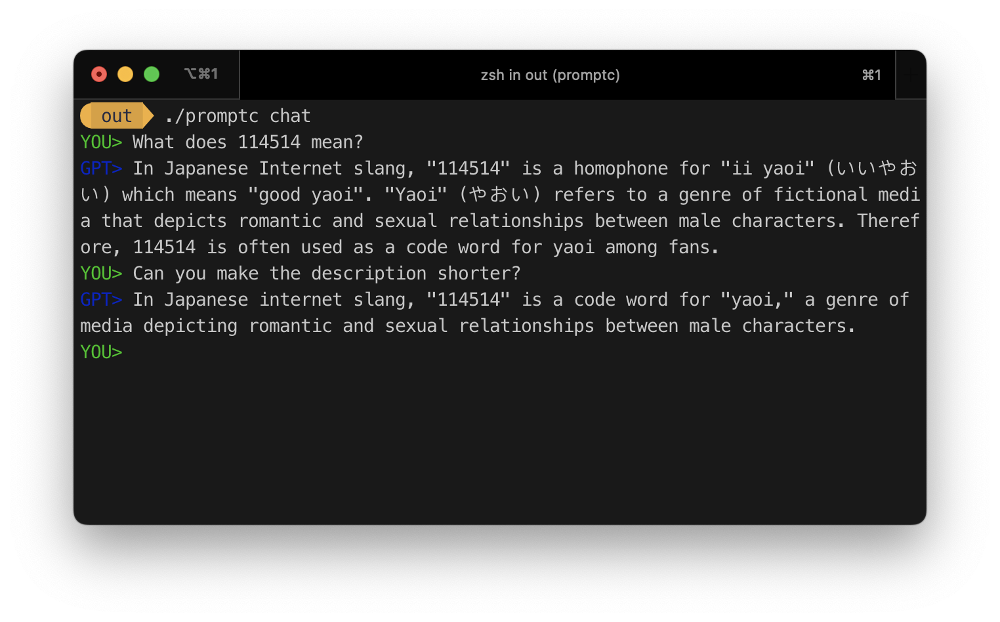

<h1 align="center">⚙️ promptc-go</h1>
<p align="center">
  [ <strong>English</strong> | <a href="README-zh.md">简体中文</a> ]
</p>

`promptc-go` is a go implementation of `promptc`. It uses
`promptc` specification to generate, analyse, build, compile & run
`promptc` files and aims to generalise the way to do Prompt Engineering.

`promptc` is a `OpenAPI`-like specification for Prompt Engineering.


## promptc-cli

<p align="center">
  
  <em>Above prompt file is adapted from
  <a href="https://github.com/zinccat/zkit">zinccat/zkit</a>,
  licensed under
  <a href="https://github.com/zinccat/ZKit/blob/main/LICENSE">GPLv3</a></em>
</p>

```sh
# As simple as it should be
$ promptc $prompt $input
```

<p align="center">
  
  <em>Chat function</em>
</p>

```sh
$ promptc chat
```

More info about promptc-cli, please refer to [docs/cli.md](docs/cli.md).

## Example Prompt File

Structured Prompt File:

```ts
// [Optional] meta info
project: test
author: KevinZonda
license: MIT
version: 0.0.1

// [Optional] define configs
conf: {
  provider: openai
  model: gpt-3.5-turbo
  temperature: 0.5
  stop: ['Hello', '4.0']
}

// [Optional] define variable constraint
vars: {
    x: int
    // var x with int type
    y: int {min: 0, max: 10}
    z: int {min: 0, max: 10, default: '5'}
}
// [Optional] Birmingham-style define var
a: int {min: 0, max: 10}

// [Required] define prompts
prompts: [
    // role: 'user' is meta info for ChatGPT
    // to make it empty, use {}
    '''role: 'user'
    You Entered: {x}
    Prompt Compiled: 
    
    '''
]
```

Single-line Prompt File<sup>Experimental</sup>:

```py
You Entered: {x}
```

## Syntax

### Single-line prompt file:

> **Note**  
> Single-line prompt file currently is an experimental feature.  
> It's not recommended to use it in production environment.

You can write the **single-line** prompt file without structured.


### Variable

#### Type

Current `promptc-go` supports `string`, `int`, `float` types.

```ts
// declare a variable
myName : string { minLen: 3, maxLen: 10, default: "John" }
// a var named `myName` of type `string`
// with default value "John"
// min length 3, max length 10

myAge : int { min: 18, max: 100, default: '18' }
// a var named `myAge` of type `int`
// with default value 18
// min value 18, max value 100

thisPrice : float { min: 0.01, default: '0.01' }
// a var named `thisPrice` of type `float`
// with default value 0.01
// min value 0.01, and unlimited max value
```

#### Constraint

- `string`
  - `minLen`: int
  - `maxLen`: int
- `int`
  - `min`: int64
  - `max`: int64
- `float`
  - `min`: float64
  - `max`: float64
- Shared
  - `default`: string

### Prompt

```py
{role: 'user'}
xx{x} {{x}} 
```

Anything in `{}` will be variable, e.g. `{x}` in previous example  
Anything in `` will be js scripts  
If you want to show `{` or `}`, use `{{` or `}}` instead

The first line of prompt is special, it provides some extra info for this prompt.  
i.e. role info for ChatGPT. e.g.

```
role: 'user'
Show me more about {x}
```

If you want to provide empty extra info, use `{}` as your first line is extremely recommended.
Although it's not required, because once hjson parse failed, the `promptc` will prepend first
line to your prompt, but it might cause plenty of undefined behaviour.

#### Reserved Value

We reserved `` for `'''` which cannot be easy done in multiline text syntax of hjson.

e.g.

```py
This is reserved  {}
```

Will be compiled to

```py
This is reserved ''' 
```

#### JavaScript in Prompt

> **Note**  
> Use JavaScript in prompt is an experimental feature.  
> `promptc-go` uses [otto](https://github.com/robertkrimen/otto) as its JavaScript runtime

> **Warning**  
> Use JavaScript in prompt could make prompt vulnerable and cause potential security breach.  
> `promptc-go` will **NOT** take any responsibility about it.

`promptc` supports embedding JavaScript scripts in prompt with `` syntax. And it supports 2 modes:

- Standard
- Easy

##### Standard Mode

In standard mode, after running the js script, the promptc will get the result from `result` variable.
    
```py
You Entered: {x}
Prompt Compiled: 
```

If enter `x = 1`, the result will be:

```
You Entered: 1
Prompt Compiled: Hello
```

##### Easy Mode

In easy mode, the promptc will get the result from returned value of js script. And it will
add an `E` at the beginning of the prompt. (``)

```py
You Entered: {x}
Prompt Compiled: 
```

If enter `x = 1`, the result will be:

```
You Entered: 1
Prompt Compiled: Hello
```

In easy mode, the script will be wrapped in a function in order to enable `return` statement.  
e.g. the actual script that will be run in previous example:

```js
result = (function(){
  if (x == "1") {
    return "Hello"
  } else {
    return "Word!";
  }  
}()
```

### Meta Info

Meta info would be act as special **wild-way defined variables** (but it will not be treated as variable).

Current supported meta info:

```ts
project: test
author: KevinZonda
license: MIT
version: 0.0.1
```

You can define same name in `vars` section if you want.

```ts
// prompt1.promptc
project: test
author: KevinZonda
license: MIT
version: 0.0.1

vars: {
    x: int
}

// VarList:
//   - x: string
```


```ts
// prompt2.promptc
project: test
author: KevinZonda
license: MIT
version: 0.0.1

vars: {
    x: int
    project: string
    license: string {minLen: 12}
}

// VarList:
//   - x: string
//   - project: string
//   - license: string
```

```ts
// prompt3.promptc
project: test
author: KevinZonda
license: MIT
version: 0.0.1

prompts: [
  '''{}
  
  '''
]
// VarList:
//   - project: string
```
