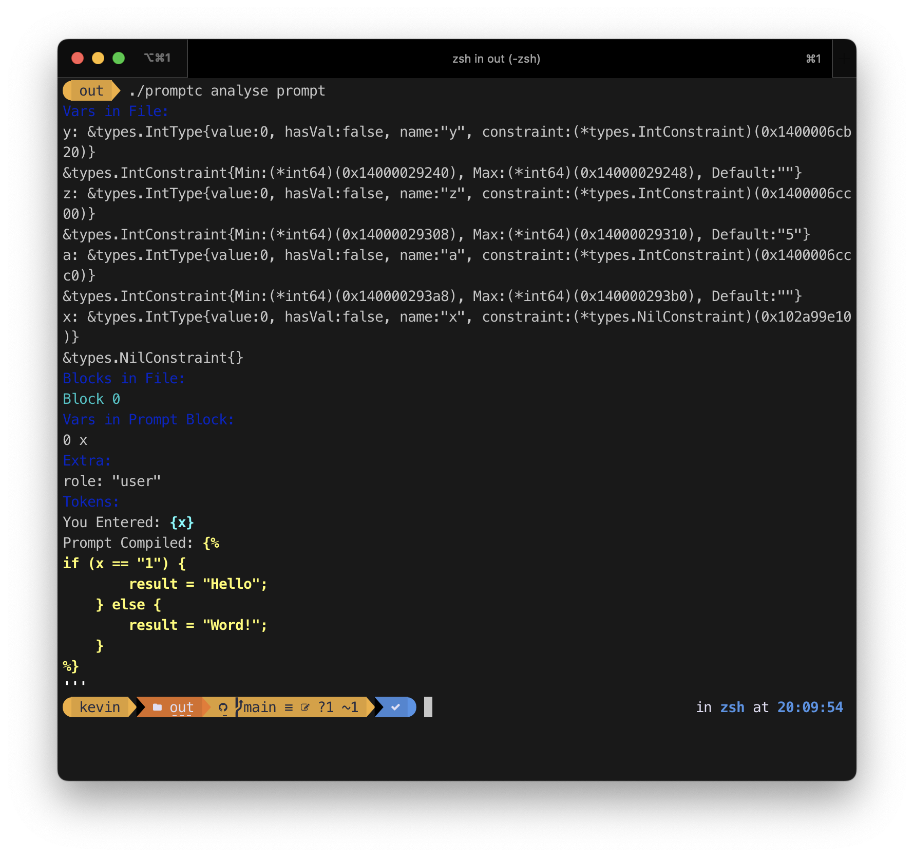

# promptc-cli

> The .NET command-line interface (CLI) is a cross-platform toolchain for developing, building, running, and publishing .NET applications.  -- [.NET Documentation](https://learn.microsoft.com/en-us/dotnet/core/tools/)

The promptc command-line interface (CLI) is a cross-platform toolchain for developing, building, running promptc files.

## Installation

? I cannot install it! I don't know how to install it!

## Config API Keys

```sh
$ promptc show
{
  openai_token: ''
}
$ promptc set openai_token <your_token>
{
  openai_token: <your_token>
}
```

## Analyse Promptc

```sh
$ promptc analyse <prompt_file>
```



The colour in Tokens sections shows parsed token type.

- `text/literal` is the literal text in prompt file. It shows in grey.
- `var` is the variable in prompt file. It shows in blue.
- `script` is the js script in prompt file. It shows in yellow.
- `reserved` is the reserved value in prompt file. It shows in white. (`'''` in last line)


## Compile Promptc

```sh
$ promptc compile <prompt_file> <var_file>
```

It will show compile details and the compiled prompt.

`var_file` is a file which contains variables for promptc. It is a key-value pair file (or ini?).

```ini
$ cat varfile
x=111
var1=This is a variable
```

## ChatGPT<sup>Beta</sup>

It should work as ChatGPT (but will not work as same as ChatGPT, cuz my code sucks)

```sh
$ promptc chat
YOU> Hello
GPT> Hello! How can I assist you today?
YOU> 
````

## Run Promptc

### Simple Run/Implicit Run

```
$ promptc <prompt_file> [vars...?]
```

It will find prompt file by following sequence:
- `<prompt_file>`
- `<prompt_file>.promptc`
- `<prompt_file>.ptc`
- `<prompt_file>.prompt`

Except the final `.prompt` file, all other files will be treated as promptc file. i.e. a structured promptc file.

The last `<prompt_file>.prompt` will be treated as a single prompt block.

If your prompt file contains no variables, the promptc will append all `vars` to the end of prompt file and run it.

For example:

```sh
$ # Following prompt file is adapted from https://github.com/zinccat/zkit, licensed under GPLv3
$ cat trans-en.prompt
I want you to act as an English translator. I will speak to you in any language and you will detect the language, translate it to English.
$ promptc trans-en "你好世界" 
================
No info provided by prompt file
================
Compiled To: 
I want you to act as an English translator. I will speak to you in any language and you will detect the language, translate it to English.
 你好世界
================
Response #0:
The language is Chinese and the translation in English is "Hello world".
```

### Run as Verb (Explicit Run)

```sh
$ promptc run <prompt_file> <var_file>
```

Not ready
